<div align="center">

# 🤖 Free Claude Code

通过你自己的 Anthropic 兼容代理使用 Claude Code CLI、VS Code、JetBrains ACP 或聊天机器人。

[](https://opensource.org/licenses/MIT)
[](https://www.python.org/downloads/)
[](https://github.com/astral-sh/uv)
[](https://github.com/Alishahryar1/free-claude-code/actions/workflows/tests.yml)
[](https://pypi.org/project/ty/)
[](https://github.com/astral-sh/ruff)
[](https://github.com/Delgan/loguru)

Free Claude Code 会把 Claude Code 的 Anthropic Messages API 流量路由到 NVIDIA NIM、Kimi、Wafer、OpenRouter、DeepSeek、LM Studio、llama.cpp、Ollama、OpenCode Zen 或 Z.ai。它保持 Claude Code 客户端协议稳定，同时让你选择免费、付费或本地模型。

[快速开始](#快速开始) · [提供方](#选择提供方) · [客户端](#连接-claude-code) · [配置](#配置参考) · [开发](#开发)

</div>

<div align="center">
  
</div>

## Star History

<div align="center">
  <a href="https://star-history.com/#Alishahryar1/free-claude-code&Date">
    <picture>
      <source media="(prefers-color-scheme: dark)" srcset="https://api.star-history.com/svg?repos=Alishahryar1/free-claude-code&type=Date&theme=dark">
      <source media="(prefers-color-scheme: light)" srcset="https://api.star-history.com/svg?repos=Alishahryar1/free-claude-code&type=Date">
      
    </picture>
  </a>
</div>

## 你能得到什么

- Claude Code Anthropic API 调用的即插即用代理。
- 十个提供方后端：NVIDIA NIM、Kimi、Wafer、OpenRouter、DeepSeek、LM Studio、llama.cpp、Ollama、OpenCode Zen 和 Z.ai。
- 按模型路由：Opus、Sonnet、Haiku 和回退流量可以发往不同提供方。
- 通过代理的 `/v1/models` 端点支持 Claude Code 原生 `/model` 选择器（Claude Code 需要启用 Gateway model discovery，见[模型选择器](#模型选择器)）。
- 支持流式输出、工具调用、reasoning/thinking block 处理和本地请求优化。
- 可选 Discord 或 Telegram 机器人封装，用于远程编码会话。
- 可选 VS Code 扩展使用方式。
- 可选语音备注转写，支持本地 Whisper 或 NVIDIA NIM。
- 本地 **管理界面** 位于 `/admin`，可编辑受支持的代理设置、验证变更并检查提供方（仅允许 loopback 访问）。

## 快速开始

### 1. 安装最新版 [Claude Code](https://code.claude.com/docs/en/overview)

```bash
npm install -g @anthropic-ai/claude-code
```

### 2. 安装运行时依赖

安装最新版 [uv](https://docs.astral.sh/uv/getting-started/installation/) 和 Python 3.14。

macOS/Linux:

```bash
curl -LsSf https://astral.sh/uv/install.sh | sh
uv self update
uv python install 3.14
```

Windows PowerShell:

```powershell
powershell -ExecutionPolicy ByPass -c "irm https://astral.sh/uv/install.ps1 | iex"
uv self update
uv python install 3.14
```

### 3. 获取 NVIDIA NIM API Key

创建一个免费的 NVIDIA NIM API key，并准备在 管理界面 设置步骤中使用。

见 [NVIDIA NIM 提供方设置](#nvidia-nim-provider)。

### 4. 安装代理

```bash
uv tool install --force git+https://github.com/Alishahryar1/free-claude-code.git
```

更新到最新版时也使用同一个命令。

### 5. 启动代理

```bash
fcc-server
```

启动后，终端会打印代理和管理界面 URL：

```text
服务 URL: http://127.0.0.1:8082
管理界面: http://127.0.0.1:8082/admin
```

很多终端会把这些 URL 显示为可点击链接。如果你的 `PORT` 不是 `8082`，请使用实际配置的端口。

### 6. 打开 管理界面 并配置 NVIDIA NIM

打开终端输出中的 **管理界面** URL。

<div align="center">
  
</div>

把 NVIDIA NIM API key 粘贴到 `NVIDIA_NIM_API_KEY`，然后点击 **验证** 和 **应用**。

默认模型已经设置为 `nvidia_nim/z-ai/glm4.7`。之后可以在同一个 管理界面 中修改。

### 7. 运行 Claude Code

```bash
fcc-claude
```

`fcc-claude` 每次启动都会读取当前配置的端口和认证令牌，设置 Claude Code 环境变量，然后启动真正的 `claude` 命令。

## 选择提供方

选择一个提供方，在 管理界面 中输入它的 key 或本地 URL，并把 `MODEL` 设置成带提供方前缀的模型 slug。`MODEL` 是回退路由。`MODEL_OPUS`、`MODEL_SONNET` 和 `MODEL_HAIKU` 可以分别覆盖 Claude Code 各模型档位的路由。

<a id="nvidia-nim-provider"></a>

### 1. [NVIDIA NIM](https://build.nvidia.com/)

在 [build.nvidia.com/settings/api-keys](https://build.nvidia.com/settings/api-keys) 获取 key。

在 管理界面 中粘贴到 `NVIDIA_NIM_API_KEY`。默认 `MODEL` 是 `nvidia_nim/z-ai/glm4.7`。

常用示例：

- `nvidia_nim/z-ai/glm4.7`
- `nvidia_nim/z-ai/glm5`
- `nvidia_nim/moonshotai/kimi-k2.5`
- `nvidia_nim/minimaxai/minimax-m2.5`

可在 [build.nvidia.com](https://build.nvidia.com/explore/discover) 浏览模型。

### 2. [Kimi](https://platform.moonshot.ai/)

在 [platform.moonshot.ai/console/api-keys](https://platform.moonshot.ai/console/api-keys) 获取 key。

在 管理界面 中粘贴到 `KIMI_API_KEY`，然后把 `MODEL` 设置为 Kimi slug，例如 `kimi/kimi-k2.5`。

可在 [platform.moonshot.ai](https://platform.moonshot.ai) 浏览模型。

### 3. [Wafer](https://wafer.ai/)

从 [wafer.ai](https://wafer.ai) 获取 key。在 管理界面 中粘贴到 `WAFER_API_KEY`，然后把 `MODEL` 设置为 Wafer Pass 模型，例如 `wafer/DeepSeek-V4-Pro`。

常用示例：

- `wafer/DeepSeek-V4-Pro`
- `wafer/MiniMax-M2.7`
- `wafer/Qwen3.5-397B-A17B`
- `wafer/GLM-5.1`

该提供方使用 Wafer 的 Anthropic 兼容端点：`https://pass.wafer.ai/v1/messages`。

### 4. [OpenRouter](https://openrouter.ai/)

在 [openrouter.ai/keys](https://openrouter.ai/keys) 获取 key。

在 管理界面 中粘贴到 `OPENROUTER_API_KEY`，然后把 `MODEL` 设置为 OpenRouter slug，例如 `open_router/stepfun/step-3.5-flash:free`。

可浏览[全部模型](https://openrouter.ai/models)或[免费模型](https://openrouter.ai/collections/free-models)。

### 5. [DeepSeek](https://platform.deepseek.com/)

在 [platform.deepseek.com/api_keys](https://platform.deepseek.com/api_keys) 获取 key。

在 管理界面 中粘贴到 `DEEPSEEK_API_KEY`，然后把 `MODEL` 设置为 DeepSeek slug，例如 `deepseek/deepseek-chat`。

该提供方使用 DeepSeek 的 Anthropic 兼容端点，不使用 OpenAI chat-completions 端点。

### 6. [LM Studio](https://lmstudio.ai/)

启动 LM Studio 的本地服务并加载模型。在 管理界面 中保留或更新 `LM_STUDIO_BASE_URL`，然后把 `MODEL` 设置为 LM Studio 显示的模型标识符，并加上 `lmstudio/` 前缀。

Claude Code 工作流建议选择支持工具调用的模型。

### 7. [llama.cpp](https://github.com/ggml-org/llama.cpp)

启动带 Anthropic 兼容 `/v1/messages` 端点的 `llama-server`，并为 Claude Code 请求准备足够上下文。

在 管理界面 中保留或更新 `LLAMACPP_BASE_URL`，然后把 `MODEL` 设置为本地模型 slug，并加上 `llamacpp/` 前缀。

本地编码模型对上下文大小很敏感。如果 llama.cpp 对常规 Claude Code 请求返回 HTTP 400，请增大 `--ctx-size`，并确认模型/服务端构建支持请求所需功能。

### 8. [Ollama](https://ollama.com/)

运行 Ollama 并拉取模型：

```bash
ollama pull llama3.1
ollama serve
```

在 管理界面 中保留或更新 `OLLAMA_BASE_URL`，然后把 `MODEL` 设置为 `ollama list` 中显示的相同 tag，并加上 `ollama/` 前缀。

`OLLAMA_BASE_URL` 是 Ollama 服务根地址，不要追加 `/v1`。示例模型 slug 包括 `ollama/llama3.1` 和 `ollama/llama3.1:8b`。

### 9. [OpenCode Zen](https://opencode.ai/)

在 [opencode.ai/auth](https://opencode.ai/auth) 获取 API key。

在 管理界面 中粘贴到 `OPENCODE_API_KEY`，然后把 `MODEL` 设置为 OpenCode Zen 模型 slug，例如 `opencode/gpt-5.3-codex`。

OpenCode Zen 是一个精选模型网关，可通过单个 API key 和兼容 OpenAI 的端点 `https://opencode.ai/zen/v1` 访问 Anthropic、OpenAI、Google、DeepSeek 等模型。

常用示例：

- `opencode/gpt-5.3-codex`
- `opencode/claude-sonnet-4`
- `opencode/deepseek-v4-flash-free`（免费）
- `opencode/gemini-3-flash`
- `opencode/big-pickle`（免费）
- `opencode/glm-5.1`

可在 [opencode.ai](https://opencode.ai) 浏览可用模型。

### 10. [Z.ai](https://z.ai/)

在 [Z.ai/manage-apikey/apikey-list](https://z.ai/manage-apikey/apikey-list) 获取 API key。

在 管理界面 中粘贴到 `ZAI_API_KEY`，然后把 `MODEL` 设置为 Z.ai 模型 slug，例如 `zai/glm-5.1`。

Z.ai 通过兼容 OpenAI 的 Coding Plan 端点 `https://api.z.ai/api/coding/paas/v4` 提供 GLM 模型。

常用示例：

- `zai/glm-5.1`
- `zai/glm-5-turbo`

可在 [Z.ai](https://z.ai) 浏览模型。

### 11. 按模型档位混用提供方

可以通过在 管理界面 中设置 `MODEL_OPUS`、`MODEL_SONNET` 和 `MODEL_HAIKU`，让每个模型档位使用不同提供方。某个档位留空时会继承 `MODEL`。

例如，你可以把 Opus 路由到 `nvidia_nim/moonshotai/kimi-k2.5`，Sonnet 路由到 `open_router/deepseek/deepseek-r1-0528:free`，Haiku 路由到 `lmstudio/unsloth/GLM-4.7-Flash-GGUF`，并让回退 `MODEL` 使用 `zai/glm-5.1`。

## 连接 Claude Code

### 1. Claude Code CLI

终端使用时，推荐使用已安装的启动器：

```bash
fcc-claude
```

工作时保持 `fcc-server` 运行。管理界面 管理代理配置；运行时设置变更时会重启服务；`fcc-claude` 每次启动都会读取当前由 管理界面 管理的端口和认证令牌。

### 2. VS Code 扩展

打开 Settings，搜索 `claude-code.environmentVariables`，选择 **Edit in settings.json**，然后添加：

```json
"claudeCode.environmentVariables": [
  { "name": "ANTHROPIC_BASE_URL", "value": "http://localhost:8082" },
  { "name": "ANTHROPIC_AUTH_TOKEN", "value": "freecc" },
  { "name": "CLAUDE_CODE_ENABLE_GATEWAY_MODEL_DISCOVERY", "value": "1" }
]
```

重新加载扩展。如果扩展显示登录页面，先选择 Anthropic Console 路径；环境变量生效后，本地代理仍会接管模型流量。

### 3. JetBrains ACP

编辑已安装的 Claude ACP 配置：

- Windows: `C:\Users\%USERNAME%\AppData\Roaming\JetBrains\acp-agents\installed.json`
- Linux/macOS: `~/.jetbrains/acp.json`

为 `acp.registry.claude-acp` 设置环境变量：

```json
"env": {
  "ANTHROPIC_BASE_URL": "http://localhost:8082",
  "ANTHROPIC_AUTH_TOKEN": "freecc",
  "CLAUDE_CODE_ENABLE_GATEWAY_MODEL_DISCOVERY": "1"
}
```

修改文件后重启 IDE。

### 4. 模型选择器

<div align="center">
  
</div>

## 可选集成

### 1. Discord 和 Telegram Bot

Bot 封装可以远程运行 Claude Code 会话、流式显示进度、支持基于回复的对话分支，并可停止或清除任务。

Discord 最小配置：

```dotenv
MESSAGING_PLATFORM="discord"
DISCORD_BOT_TOKEN="your-discord-bot-token"
ALLOWED_DISCORD_CHANNELS="123456789"
CLAUDE_WORKSPACE="./agent_workspace"
ALLOWED_DIR="C:/Users/yourname/projects"
```

在 [Discord Developer Portal](https://discord.com/developers/applications) 创建 bot，启用 Message Content Intent，并使用 read/send/history 权限邀请它。

Telegram 最小配置：

```dotenv
MESSAGING_PLATFORM="telegram"
TELEGRAM_BOT_TOKEN="123456789:ABC..."
ALLOWED_TELEGRAM_USER_ID="your-user-id"
CLAUDE_WORKSPACE="./agent_workspace"
ALLOWED_DIR="C:/Users/yourname/projects"
```

从 [@BotFather](https://t.me/BotFather) 获取 token，并从 [@userinfobot](https://t.me/userinfobot) 获取你的用户 ID。

常用命令：

- `/stop` 取消任务；回复某个任务消息时只停止该分支。
- `/clear` 重置会话；回复某个分支时只清除该分支。
- `/stats` 显示会话状态。

### 2. 语音备注

语音备注支持 Discord 和 Telegram。选择一个后端：

```bash
uv sync --extra voice_local
uv sync --extra voice
uv sync --extra voice --extra voice_local
```

```dotenv
VOICE_NOTE_ENABLED=true
WHISPER_DEVICE="cpu"          # cpu | cuda | nvidia_nim
WHISPER_MODEL="base"
HF_TOKEN=""
```

如果使用 NVIDIA 托管转写，请安装 `voice` extra，并设置 `WHISPER_DEVICE="nvidia_nim"` 和 `NVIDIA_NIM_API_KEY`。

## 配置参考

[`.env.example`](.env.example) 是变量的权威列表。下面是多数用户会修改的部分。

### 1. 手动 `.env` 设置（无界面环境）

仅当你偏好基于文件的配置，或运行在无界面环境时使用。首次设置时 管理界面 更简单。

```bash
cp .env.example .env
```

NVIDIA NIM 示例：

```dotenv
NVIDIA_NIM_API_KEY="nvapi-your-key"
MODEL="nvidia_nim/z-ai/glm4.7"
ANTHROPIC_AUTH_TOKEN="freecc"
```

配置优先级依次为仓库 `.env`、`~/.config/free-claude-code/.env`，最后是设置了 `FCC_ENV_FILE` 时的该文件。`ANTHROPIC_AUTH_TOKEN` 可以是任意本地密钥；传给 Claude Code 的值必须相同。

### 2. 模型路由

```dotenv
MODEL="nvidia_nim/z-ai/glm4.7"
MODEL_OPUS=
MODEL_SONNET=
MODEL_HAIKU=
ENABLE_MODEL_THINKING=true
ENABLE_OPUS_THINKING=
ENABLE_SONNET_THINKING=
ENABLE_HAIKU_THINKING=
```

各档位留空时继承回退模型。单模型 thinking 覆盖项留空时继承 `ENABLE_MODEL_THINKING`。

### 3. 提供方 Key 和 URL

```dotenv
NVIDIA_NIM_API_KEY=""
OPENROUTER_API_KEY=""
DEEPSEEK_API_KEY=""
WAFER_API_KEY=""
OPENCODE_API_KEY=""
ZAI_API_KEY=""
LM_STUDIO_BASE_URL="http://localhost:1234/v1"
LLAMACPP_BASE_URL="http://localhost:8080/v1"
OLLAMA_BASE_URL="http://localhost:11434"
```

代理设置按提供方分别配置：

```dotenv
NVIDIA_NIM_PROXY=""
OPENROUTER_PROXY=""
LMSTUDIO_PROXY=""
LLAMACPP_PROXY=""
WAFER_PROXY=""
OPENCODE_PROXY=""
ZAI_PROXY=""
```

### 4. 速率限制和超时

```dotenv
PROVIDER_RATE_LIMIT=1
PROVIDER_RATE_WINDOW=3
PROVIDER_MAX_CONCURRENCY=5
HTTP_READ_TIMEOUT=120
HTTP_WRITE_TIMEOUT=10
HTTP_CONNECT_TIMEOUT=10
```

免费托管提供方建议使用较低限制；本地提供方通常可以承受更高并发，前提是机器性能足够。

### 5. 安全和诊断

```dotenv
ANTHROPIC_AUTH_TOKEN=
LOG_RAW_API_PAYLOADS=false
LOG_RAW_SSE_EVENTS=false
LOG_API_ERROR_TRACEBACKS=false
LOG_RAW_MESSAGING_CONTENT=false
LOG_RAW_CLI_DIAGNOSTICS=false
LOG_MESSAGING_ERROR_DETAILS=false
```

原始日志开关可能暴露 prompt、工具参数、路径和模型输出。除非你正在本地调试，否则保持关闭。

结构化 TRACE 行会追加 `"trace": true`、`stage`、`event` 和 `source` 等字段，并包含端到端跟踪 Claude Code 流程所需的对话上下文。类似凭据的字典键（例如结构化载荷中的 `api_key` / `authorization` 值）会被脱敏；你在 prompt 中输入的任意自然语言仍可能原样出现。

### 6. 本地 Web 工具

```dotenv
ENABLE_WEB_SERVER_TOOLS=true
WEB_FETCH_ALLOWED_SCHEMES=http,https
WEB_FETCH_ALLOW_PRIVATE_NETWORKS=false
```

这些工具会从代理发起出站 HTTP。除非处于受控实验环境，否则保持私有网络访问禁用。

## 工作原理

<div align="center">
  
</div>

图表源文件：[`assets/how-it-works.mmd`](assets/how-it-works.mmd)。

关键部分：

- FastAPI 暴露 Anthropic 兼容路由，例如 `/v1/messages`、`/v1/messages/count_tokens` 和 `/v1/models`。
- 模型路由把 Claude 模型名解析到 `MODEL_OPUS`、`MODEL_SONNET`、`MODEL_HAIKU` 或 `MODEL`。
- NIM、OpenCode Zen、Z.ai 使用 OpenAI chat streaming，并转换为 Anthropic SSE。
- Wafer、OpenRouter、DeepSeek、LM Studio、llama.cpp 和 Ollama 使用 Anthropic Messages 风格传输。
- 代理会把 thinking block、工具调用、token usage 元数据和提供方错误统一成 Claude Code 期望的形状。
- 请求优化会在本地回答简单的 Claude Code 探测请求，以节省延迟和额度。

## 开发

### 1. 项目结构

```text
free-claude-code/
├── server.py              # ASGI 入口
├── api/                   # FastAPI 路由、服务层、路由逻辑、优化
├── core/                  # 共享 Anthropic 协议辅助函数和 SSE 工具
├── providers/             # 提供方传输、注册表、速率限制
├── messaging/             # Discord/Telegram 适配器、会话、语音
├── cli/                   # 包入口点和 Claude 进程管理
├── config/                # 设置、提供方目录、日志
└── tests/                 # 单元测试和契约测试
```

### 2. 从源码运行

如果你在开发，或想直接从 checkout 运行，请使用这种方式：

```bash
git clone https://github.com/Alishahryar1/free-claude-code.git
cd free-claude-code
uv run uvicorn server:app --host 0.0.0.0 --port 8082
```

### 3. 命令

```bash
uv run ruff format
uv run ruff check
uv run ty check
uv run pytest
```

推送前按上述顺序运行。CI 会强制执行同样的检查。

### 4. 包脚本

`pyproject.toml` 会安装：

- `fcc-server`：使用配置的 host 和 port 启动代理。
- `fcc-init`：在 `~/.config/free-claude-code/.env` 创建可选的文件式配置脚手架。
- `fcc-claude`：使用配置的本地代理 URL、认证令牌和模型发现标记启动 Claude Code。
- `free-claude-code`：`fcc-server` 的兼容别名。

### 5. 扩展

- 添加兼容 OpenAI 的提供方时，扩展 `OpenAIChatTransport`。
- 添加 Anthropic Messages 提供方时，扩展 `AnthropicMessagesTransport`。
- 在 `config.provider_catalog` 注册提供方元数据，并在 `providers.registry` 中接入工厂。
- 添加消息平台时，在 `messaging/` 中实现 `MessagingPlatform` 接口。

## 贡献

- 在 [Issues](https://github.com/Alishahryar1/free-claude-code/issues) 报告 bug 和功能请求。
- 保持改动小，并用聚焦测试覆盖。
- 不要提交 Docker 集成 PR。
- README 变更不要直接开 PR，请先开 issue。
- 开 pull request 前运行完整检查序列。
- Python 3.14 正式版恢复了 `except X, Y` 语法（3.14 alpha 没有）。开 PR 前请记住这一点。

## 许可证

MIT 许可证。详见 [LICENSE](LICENSE)。
